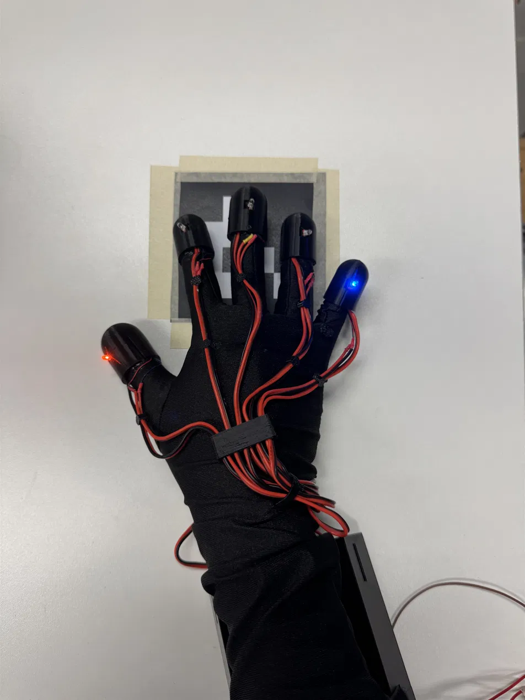
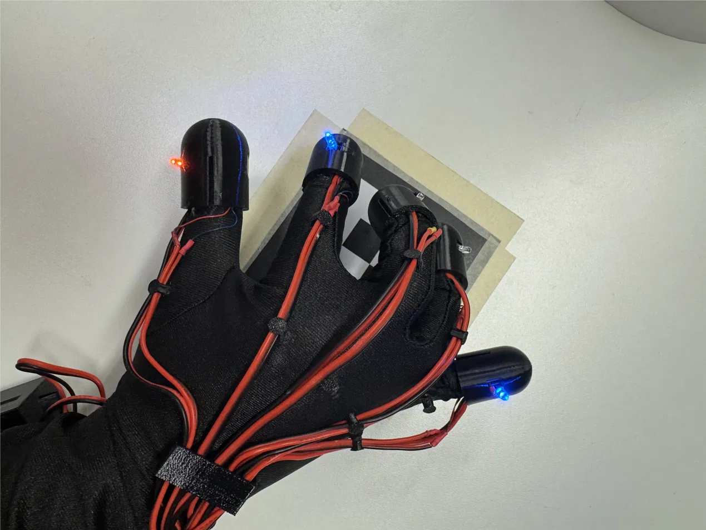
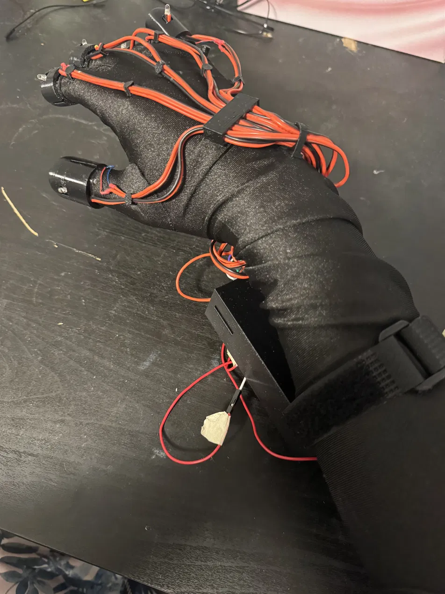
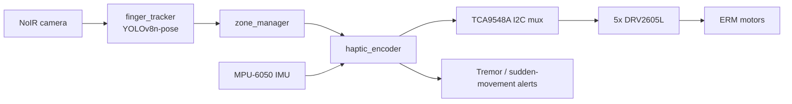
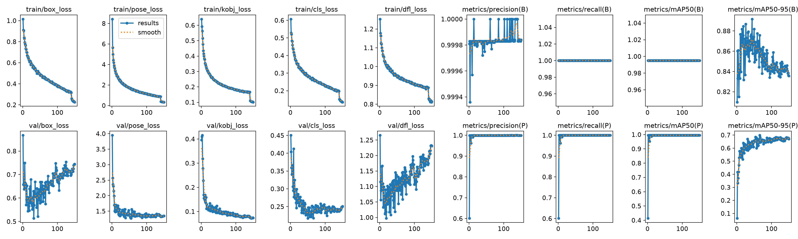
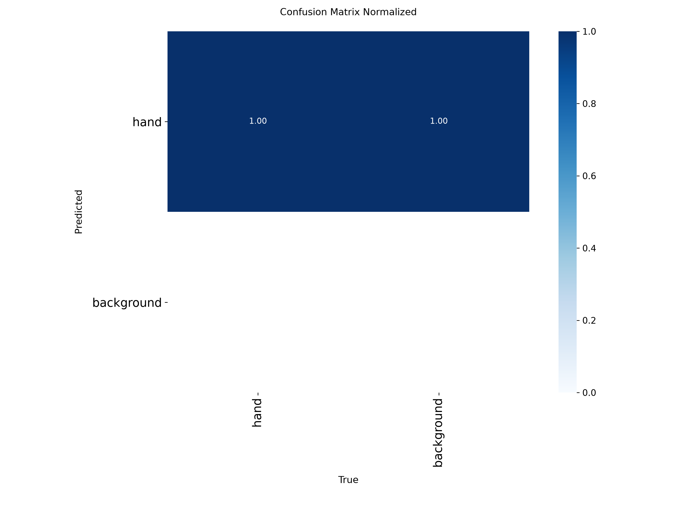
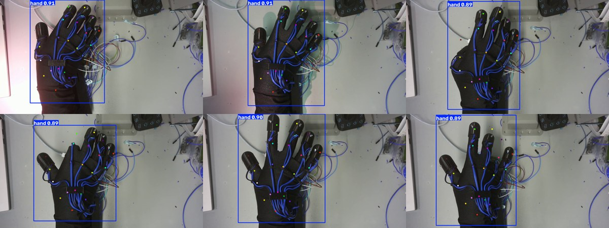

# Haptic Glove

A wearable haptic feedback glove that tracks the user's hand in real time and delivers per-finger vibration cues, with built-in safety monitoring. Runs entirely on a Raspberry Pi 4 with ROS2.

<p align="center"></p>

## Features

- **Per-finger haptic feedback**: 5 ERM vibration motors (thumb to pinky) driven through DRV2605L drivers in real-time playback mode
- **Custom gloved-hand tracking**: MediaPipe fails on the gloved hand because wires and the perfboard break the bare-hand silhouette, so I trained a custom **YOLOv8n-pose** model (21 keypoints) and deployed it on the Pi with ONNX Runtime
- **Safety monitoring**: IMU-based tremor detection (`/tremor_alert`) and a sudden-movement safety stop (`/sudden_move_alert`)
- **Marker-defined work zone**: an ArUco marker defines the treatment/work area, and the camera uses it to set the safety zone

<p align="center"></p>
<p align="center"><em>Fingertip LEDs indicate each finger's state as the hand moves over the ArUco-marked work area.</em></p>

## Hardware

| Component | Details |
|---|---|
| Compute | Raspberry Pi 4 (4GB), Ubuntu Server 24.04, ROS2 Jazzy |
| Haptics | 5x DRV2605L (0x5A) + ERM motors, one per finger |
| I2C mux | TCA9548A (0x70): channels 0-4 for the haptic drivers, channel 5 for the IMU |
| IMU | MPU-6050 (0x68) |
| Camera | Raspberry Pi NoIR camera (imx708) |
| Enclosure | TPU finger caps with motor and LED pockets, SolidWorks forearm shell for the electronics |

All five haptic drivers share one I2C address, so they sit behind the TCA9548A multiplexer. IMU reads are consolidated into the haptic encoder node and guarded with a `threading.Lock()` to avoid bus conflicts.

<p align="center"></p>
<p align="center"><em>First hardware prototype: all components connected with jumper wires, before soldering.</em></p>

## System Pipeline



| Package | Role |
|---|---|
| `finger_tracker` | Detects finger positions from the camera feed |
| `zone_manager` | Checks each finger against the defined zone |
| `haptic_encoder` | Maps zone state to motor intensity, reads the IMU, raises safety alerts |
| `probe_tracker` | MPU-6050 IMU publisher |
| `haptic_launch` | Launches the full pipeline |

## Challenges & Solutions

| Challenge | Root cause | Solution |
|---|---|---|
| MediaPipe could not track the gloved hand | Wires, fingertip caps, and the perfboard break the bare-hand silhouette MediaPipe is trained on | Recorded 18 clips, labeled 21 keypoints in self-hosted CVAT, and trained a custom YOLOv8n-pose model on 3,332 frames |
| Five haptic drivers on one I2C bus | Every DRV2605L has the same fixed address (0x5A) | Placed each driver on its own TCA9548A multiplexer channel (0-4), with the IMU on channel 5 |
| Intermittent I2C read/write errors | The IMU and haptic drivers were accessed from separate nodes, so multiplexer channel switches interleaved | Consolidated IMU reads into the `haptic_encoder` node and guarded each channel switch and transaction with a `threading.Lock()` |
| Model crashed on the Pi 4 | onnxruntime 1.28 fails with a bus error on the Pi 4 | Pinned `onnxruntime==1.18.1` and added a 2GB swap file |
| Very low confidence from the 320x320 model | Input resolution far below the 640x640 training size | Exported at 640x640 and ran inference every 3rd frame to stay near real-time |
| Accuracy drop on the live feed | Color-correcting the NoIR camera output made live frames look different from the training data | Fed raw frames to the model, matching the training data |
| Risk of inflated validation scores | Neighboring video frames are nearly identical | Held out entire CVAT jobs (clips) for validation instead of random frames |

## Repository Structure

```
ros2_ws/src/   ROS2 packages (see table above)
pi/vision/     Standalone Pi scripts: YOLO hand tracking, ArUco zone detection, integrated safety
pi/dataset/    Dataset recording and frame extraction
pi/tools/      Hardware test utilities (LEDs)
training/      YOLO dataset building and training plots
weights/       Trained model (best.pt, best.onnx)
results/       Training metrics and validation images
```

## Running

```bash
# ROS2 pipeline
cd ros2_ws
colcon build
source install/setup.bash
ros2 launch haptic_launch haptic.launch.py

# Standalone YOLO hand tracking (live stream on port 5004)
cp weights/best.onnx ~/best.onnx
python3 pi/vision/yolo_hand_live.py
```

## Hand Tracking Model

### Data pipeline

1. Recorded 18 gloved-hand clips on the Pi with a fixed overhead camera (varied angles, lighting, speed, and poses including fist, grab, and pinch)
2. Labeled 21-point hand keypoints (MediaPipe topology) in **self-hosted CVAT v2.71.0** using keyframes and interpolation
3. Exported labels in COCO Keypoints 1.0 format
4. `training/build_yolo_dataset.py` converts the exports into YOLOv8-pose format
5. Trained YOLOv8n-pose (see `training/data.yaml`)

### Results

YOLOv8n-pose trained on 3,332 frames for 150 epochs with HSV augmentation. Gloved-hand validation data is held out as entire CVAT jobs rather than random frames, so near-identical neighboring frames never appear in both the training and validation sets.

| Metric | Score |
|---|---|
| Pose mAP50-95 | 0.698 |
| Box mAP50-95 | 0.876 |




**Predictions on held-out validation frames** (selected to cover different poses and lighting)



### Deployment notes

- 640x640 ONNX model running on `onnxruntime==1.18.1`
- Inference every 3rd frame
- 2GB swap file required
- Raw (uncorrected) NoIR frames are fed to the model
