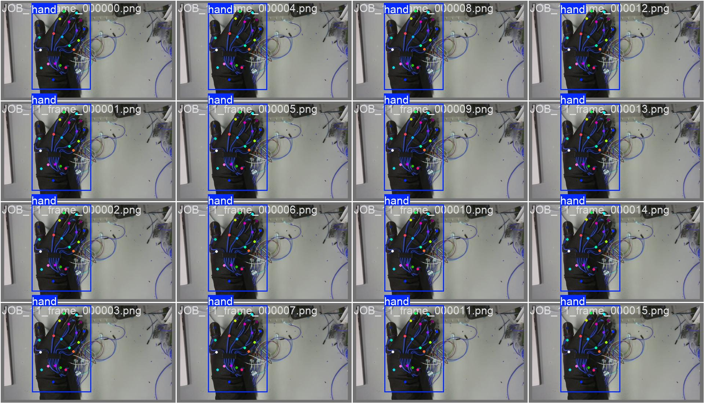
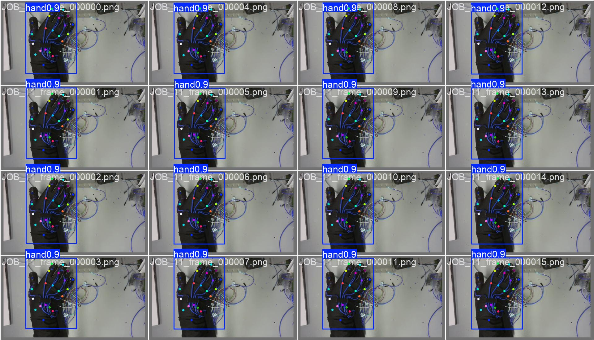

# Haptic Glove Project

Custom hand-pose detection pipeline for a haptic feedback glove (Raspberry Pi 4).

## Pipeline

1. Recorded gloved-hand video clips on the Pi
2. Labeled 21-point hand keypoints using **self-hosted CVAT v2.71.0** (official repo, default docker-compose setup — no custom config)
3. Exported labels in COCO Keypoints 1.0 format
4. `training/build_yolo_dataset.py` — converts CVAT exports into YOLOv8-pose dataset format
5. Trained YOLOv8n-pose on the dataset (see `training/data.yaml`)
6. `training/plot_yolo_training_results*.py` — visualizes training metrics

## Results

Trained YOLOv8n-pose on 3,332 frames (18 recorded clips), 150 epochs with HSV augmentation.

| Metric | Score |
|---|---|
| Pose mAP50 | - |
| Pose mAP50-95 | 0.698 |
| Box mAP50 | - |
| Box mAP50-95 | 0.876 |

**Validation predictions vs ground truth:**

Pretrained weights available in [`weights/`](weights/) (best.pt, best.onnx).

## Notes

- Labeling/preprocessing scripts (auto_label, frame extraction) currently live on a separate laptop — to be migrated
- Deployed model runs as ONNX (320x320 or 640x640) on the Pi via onnxruntime
